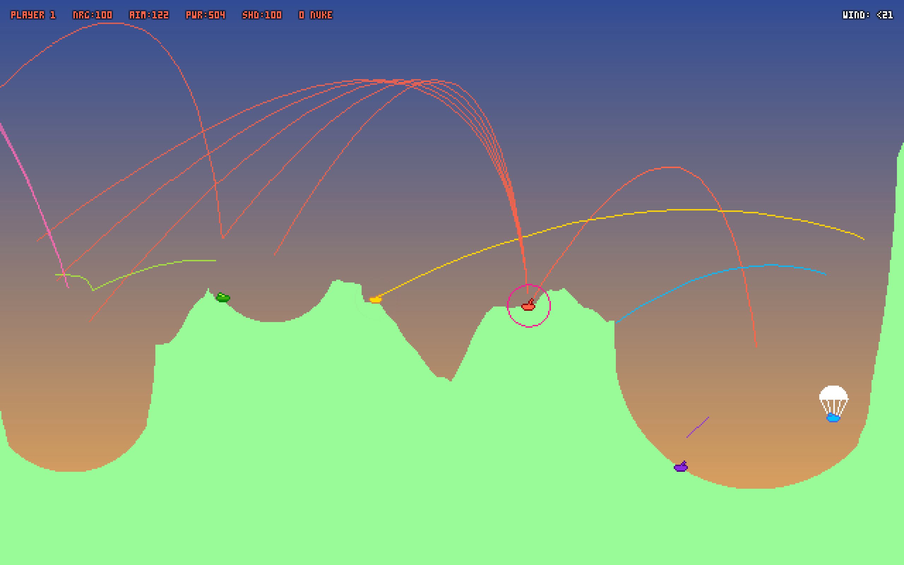

# Ravaged Planet

A modern [Scorched Earth](https://en.wikipedia.org/wiki/Scorched_Earth_(video_game)) clone.

[Play it for free on itch.io](https://pastry.itch.io/ravaged-planet)

## How to play

Tanks take turns to shoot at other tanks. The last surviving tank wins the round. Player 1 (red) is controlled via the keyboard, while other players are randomly-picked AIs.

| Key | Function | With Shift | With Alt |
|-|-|-|-|
| Up/Down | Increase/decrease firing power | Increase/decrease by 10 | Increase/decrease slowly |
| Left/Right | Aim higher/lower | Increase/decrease by 10 | Increase/decrease slowly |
| Tab | Switch to your next weapon | Switch to your previous weapon | |

## Features

- [X] Play up to six tanks at once
- [X] Colorful retro graphics
- [X] Special graphic effects
- [X] Bullet physics, traces and sounds
- [X] Randomly generated terrains
- [X] Wide assortment of weapons
- [ ] Wide asssortment of tools (only shields and parachutes implemented so far)
- [ ] Many different tanks to pick from
- [ ] Many AIs to battle against (only Moron and Chooser implemented so far)
- [ ] Long, multiple-round battles
- [ ] Weapons & tools market
- [ ] Configuration
- [ ] Local Multiplayer
- [ ] Internet Multiplayer

## License

Licensed under the MIT LICENSE.

Copyright (c) 2019 zenoamaro <zenoamaro@gmail.com>
